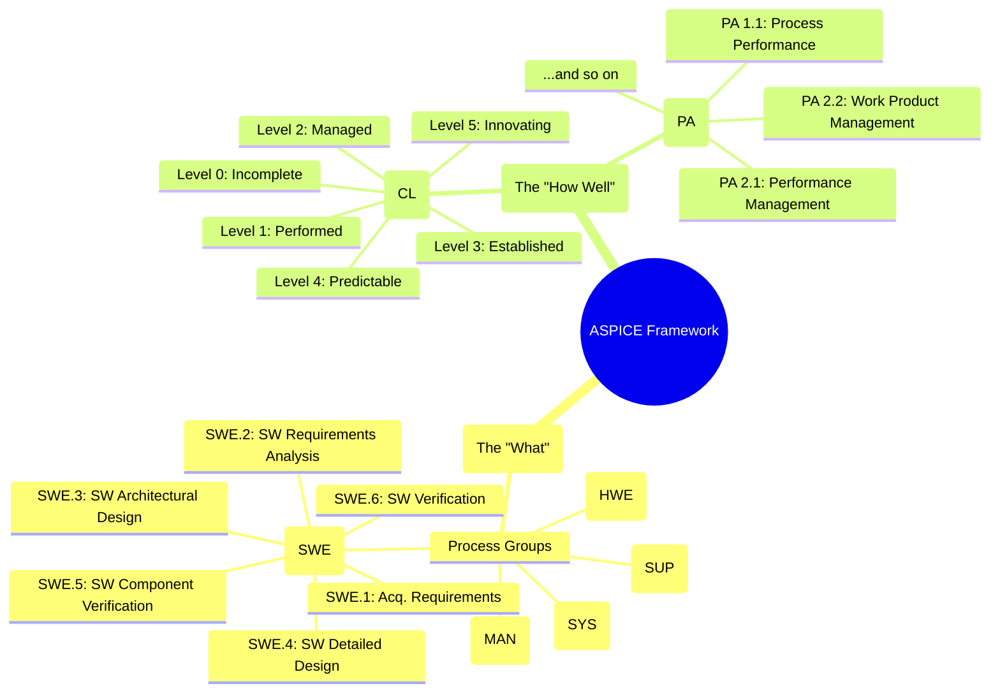
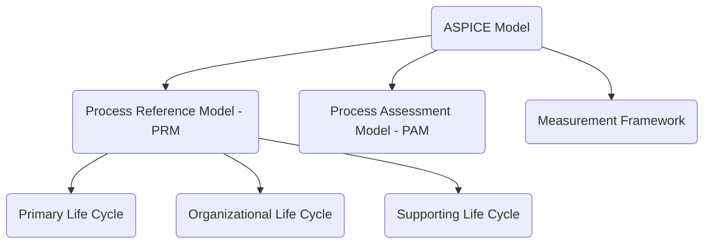
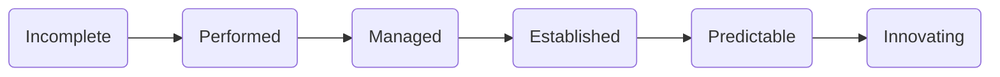

# 🚗 ASPICE: The Quality Recipe for Automotive Software

Welcome to the world of Automotive SPICE (ASPICE)! Think of it as the official, industry-standard **recipe book** for creating high-quality software for cars. Just like a master chef follows a detailed recipe to ensure every dish is perfect, automotive teams follow ASPICE processes to ensure their software is safe, reliable, and well-documented. It's not about *what* to build, but *how* to build it right.

This guide provides a concise overview of ASPICE 4.0, focusing on the key concepts and testing-related processes.

> **Disclaimer:**
> This document is AI-generated and intended for educational and reference purposes only. It is not an official ASPICE publication and should not be used as a substitute for the official ASPICE documentation or for formal assessments.

### 🗓️ Version Information

| ASPICE Version Referenced | Document Version |
|--------------------------|-----------------|
| 4.0 (with 3.1 comparisons) | 2025-06-27      |

---

## 📑 Table of Contents

1. [What is ASPICE?](#-what-is-aspice)
2. [The ASPICE Framework at a Glance](#-the-aspice-framework-at-a-glance)
3. [ASPICE Model Structure](#-aspice-model-structure)
    - [Process Reference Model (PRM)](#-process-reference-model-prm)
    - [Measurement Framework](#-measurement-framework)
4. [Assessment Process](#-assessment-process)
5. [Key Testing-Related Processes](#-key-testing-related-processes)
    - [SWE.5 Software Component Verification and Integration Verification](#-swe5-software-component-verification-and-integration-verification)
    - [SWE.6 Software Verification](#-swe6-software-verification)
    - [VAL.1 Validation](#-val1-validation)
6. [ASPICE Process Groups and Scope](#-aspice-process-groups-and-main-processes)
7. [Summary Table: Testing-Related ASPICE Processes](#-summary-table-testing-related-aspice-processes)
8. [Key Terms and Acronyms](#-key-terms-and-acronyms)
9. [References](#-references)

---

## 🗺️ The ASPICE Framework at a Glance

This mindmap provides a high-level overview of the two dimensions that make up the ASPICE framework.

---

## 🏁 What is ASPICE?

Let's start with the big picture. What is this framework, and why is it so critical in the automotive world?

ASPICE (Automotive SPICE) is a process assessment model for evaluating and improving automotive software and embedded systems development. It aligns with ISO/IEC 330xx standards and is tailored for the automotive industry.

| Aspect               | Description                                                                 |
|----------------------|-----------------------------------------------------------------------------|
| Process Evaluation   | Assesses process capability against standards                               |
| Compliance           | Aligns with ISO/IEC 330xx                                                  |
| Automotive Focus     | Tailored process models for automotive needs                                |
| Improvement Guidance | Identifies current state and guides process improvement                     |

The PRM and PAM conform to ISO/IEC 33004:2015; the Measurement Framework aligns with ISO/IEC 33003:2015.

---

## 🏗️ ASPICE Model Structure

The ASPICE model is built on two main pillars: the **Process Reference Model (PRM)**, which defines *what* to do, and the **Process Assessment Model (PAM)**, which includes a framework for measuring *how well* you do it.

### 🗂️ Process Reference Model (PRM)

Processes are organized into three categories:

| Category                  | Description                                  |
|---------------------------|----------------------------------------------|
| Primary Life Cycle        | Core development and delivery activities     |
| Organizational Life Cycle | Management and organizational practices      |
| Supporting Life Cycle     | Supplementary/support functions              |

Each process has a **purpose statement** and **specific outcomes**.

| ASPICE 4.0 PRM | ASPICE 3.1 PRM |
|----------------|----------------|
|  |  |

#### 📊 Model Structure Overview

---

### 📏 Measurement Framework

Defines **capability levels** and **process attributes (PA)** for systematic assessment.

| Level | Name        | Description                                                    |
|-------|-------------|----------------------------------------------------------------|
| 0     | Incomplete  | Not implemented or fails to achieve purpose                    |
| 1     | Performed   | Implemented and achieves intended purpose                      |
| 2     | Managed     | Planned, monitored, adjusted; work products controlled         |
| 3     | Established | Defined approach, reliably achieves outcomes                   |
| 4     | Predictable | Operates predictively, uses quantitative management            |
| 5     | Innovating  | Continuously improved and adapted                              |

**Nine process attributes** are used to evaluate capability, grouped by level:

| Level | Process Attribute (PA) |
|---|---|
| 1 | **PA 1.1** Process Performance |
| 2 | **PA 2.1** Performance Management **PA 2.2** Work Product Management |
| 3 | **PA 3.1** Process Definition **PA 3.2** Process Deployment |
| 4 | **PA 4.1** Quantitative Analysis **PA 4.2** Quantitative Control |
| 5 | **PA 5.1** Process Innovation **PA 5.2** Process Innovation Implementation |

#### 🏅 Capability Levels (Mermaid)

#### Rating Scale

Each Process Attribute is rated on the following NPLF scale:

| Rating | Meaning | Description |
|---|---|---|
| **N** | Not achieved | 0 to 15% achievement |
| **P** | Partially achieved | > 15% to 50% achievement |
| **L** | Largely achieved | > 50% to 85% achievement |
| **F** | Fully achieved | > 85% to 100% achievement |

A Capability Level is only achieved if all of its constituent Process Attributes are rated as "Largely" or "Fully" achieved.

---

## 🧩 Assessment Process

How do you know if a team is following the recipe correctly? Through an assessment. This section briefly outlines how an ASPICE assessment works.

### Assessment Indicators vs Process Capability

| Visuals |
|---------|
|  |

### ASPICE Assessment Process Overview

| Step        | Description                                                                 |
|-------------|-----------------------------------------------------------------------------|
| Preparation | Define scope, select processes, gather documentation                        |
| Assessment  | Interview stakeholders, review evidence, rate process attributes            |
| Reporting   | Summarize findings, assign capability levels, recommend improvements        |

#### 🧭 Assessment Process Flow (Mermaid)

---

## 🧪 Key Testing-Related Processes

While ASPICE covers the entire development lifecycle, let's zoom in on the processes most relevant to testing. These processes ensure that software is rigorously verified and validated at every stage.

### 🧱 SWE.5 Software Component Verification and Integration Verification

| Aspect   | Description                                                                                   |
|----------|----------------------------------------------------------------------------------------------|
| Purpose  | Verify software components and integration against architecture and detailed design           |
| Outcomes | Measures specified, integration performed, verification results recorded, traceability ensured|

#### 🔍 Base Practices Comparison

| BP   | ASPICE 3.1 Description                        | ASPICE 4.0 Description                                 |
|------|-----------------------------------------------|--------------------------------------------------------|
| BP1  | Develop software integration strategy          | Specify software integration verification measures      |
| BP2  | Develop integration test strategy (regression) | Specify verification for component behavior             |
| BP3  | Develop integration test specification         | Select verification measures                            |
| BP4  | Integrate units/items                          | Integrate elements and perform integration verification |
| BP5  | Select test cases                              | Perform component verification                          |
| BP6  | Perform integration test                       | Ensure consistency & establish bidirectional traceability|
| BP7  | Establish bidirectional traceability           | Summarize and communicate results                       |
| BP8  | Ensure consistency                             | *Merged into BP6*                                       |
| BP9  | Summarize and communicate results              | *Merged into BP7*                                       |

| Visuals |
|---------|
|  |

---

### 🧪 SWE.6 Software Verification

| Aspect   | Description                                                                                   |
|----------|----------------------------------------------------------------------------------------------|
| Purpose  | Ensure integrated software is verified against requirements                                  |
| Outcomes | Measures specified, verification performed, results recorded, traceability ensured           |

#### 🔍 Base Practices Comparison

| BP   | ASPICE 3.1 Description                        | ASPICE 4.0 Description                                 |
|------|-----------------------------------------------|--------------------------------------------------------|
| BP1  | Develop qualification test strategy            | Specify verification measures for software verification |
| BP2  | Develop qualification test specification       | Select verification measures                            |
| BP3  | Select test cases                             | Verify integrated software                              |
| BP4  | Test integrated software                      | Ensure consistency & establish bidirectional traceability|
| BP5  | Establish bidirectional traceability          | Summarize and communicate results                       |
| BP6  | Ensure consistency                            | *Merged into BP4*                                       |
| BP7  | Summarize and communicate results             | *Merged into BP5*                                       |

| Visuals |
|---------|
|  |

---

### ✅ VAL.1 Validation

| Aspect   | Description                                                                                   |
|----------|----------------------------------------------------------------------------------------------|
| Purpose  | Provide evidence that the end product meets intended use in its operational environment      |
| Outcomes | Validation measures selected, validation performed, results recorded, traceability ensured   |

#### 🔍 Base Practices

| BP   | Description                                               |
|------|----------------------------------------------------------|
| BP1  | Specify validation measures for product validation        |
| BP2  | Select validation measures                                |
| BP3  | Perform validation and evaluate results                   |
| BP4  | Ensure consistency & establish bidirectional traceability |
| BP5  | Summarize and communicate results                         |

| Visuals |
|---------|
|  |

---

## 🚗 ASPICE in Practice: Developing a Lane Keep Assist Feature

All these processes and acronyms can feel very abstract. Let's make it concrete with a simplified example. Imagine we're on a team developing a "Lane Keep Assist" (LKA) feature. How would some of the key testing processes apply?

### SWE.5: Verifying the Software Components

*   **What it is:** This is where we test the individual "pieces" of our LKA software and how they fit together.
*   **In Practice:**
    *   **Component Verification:** We'd have a software component that reads camera data. We would write a unit test for the function `find_lane_markers(camera_image)` to ensure it correctly identifies lane lines in various test images (day, night, rain).
    *   **Integration Verification:** We would then test if the `camera_reader` component correctly sends its data to the `steering_controller` component. We're not testing the whole LKA system yet, just that these two pieces can talk to each other as designed.

### SWE.6: Verifying the Whole Software

*   **What it is:** Now we test the *entire* LKA software package after all the components have been integrated.
*   **In Practice:**
    *   We would run the complete LKA software on a test bench or in a simulation (like a SiL environment).
    *   We'd have test cases like: "Given a simulated straight road, verify the software commands a steering angle of 0 degrees." or "Given a simulated gentle curve, verify the software commands a correct steering adjustment."
    *   This is about verifying that the software as a whole meets its specified requirements.

### VAL.1: Validating the Feature in the Real World

*   **What it is:** This is the final step: proving that the feature actually works for the driver in a real car.
*   **In Practice:**
    *   We would install the LKA system in a real test vehicle.
    *   A test driver would take the car on a real highway and perform validation tests like: "The vehicle shall stay in the center of the lane for 10 km without driver intervention."
    *   This isn't just about meeting technical requirements; it's about validating that the feature meets the *user's* (the driver's) needs and is safe and effective in its intended environment.

---

## 🗂️ ASPICE Process Groups and Main Processes

| Category                  | Process Groups                | Example Processes         |
|---------------------------|------------------------------|--------------------------|
| Primary Life Cycle        | System, Software, Hardware   | SYS.1, SWE.1–SWE.6, HWE.1|
| Organizational Life Cycle | Management, Improvement      | MAN.3, SUP.1, SUP.8      |
| Supporting Life Cycle     | Support, Reuse               | SUP.1–SUP.10, REU.2      |

For a full list, refer to the [ASPICE 4.0 Reference Manual](https://vda-qmc.de/wp-content/uploads/2023/12/Automotive-SPICE-PAM-v40.pdf).

---

## 🏁 Summary Table: Testing-Related ASPICE Processes

| Process | Purpose | Key Outcomes | Typical Work Products |
|---------|---------|--------------|----------------------|
| SWE.5   | Component & integration verification | Measures specified, integration performed, results recorded, traceability | Integration test strategy, test specs, test reports |
| SWE.6   | Software verification | Measures specified, verification performed, results recorded, traceability | Qualification test strategy, test specs, test reports |
| VAL.1   | Validation | Validation measures selected, validation performed, results recorded, traceability | Validation plan, validation reports |

---

## 📝 Key Terms and Acronyms

| Acronym | Meaning                                                    |
|---------|------------------------------------------------------------|
| ASPICE  | Automotive SPICE (Systems Process Improvement and Capability Determination) |
| PRM     | Process Reference Model                                    |
| PAM     | Process Assessment Model                                   |
| BP      | Base Practice                                              |
| PA      | Process Attribute                                          |
| SWE     | Software Engineering                                       |
| VAL     | Validation                                                 |

---

## 📚 References

- [Automotive SPICE 4.0 Reference Manual (PDF)](https://vda-qmc.de/wp-content/uploads/2023/12/Automotive-SPICE-PAM-v40.pdf)
- [Automotive SPICE 4.0 Pocket Guide (PDF)](https://www.ul.com/sites/default/files/2024-10/Automotive_Spice_Pocket_Guide.pdf)
- [Official ASPICE Website](https://vda-qmc.de/en/automotive-spice/automotive-spice-veroeffentlichungen)

---

