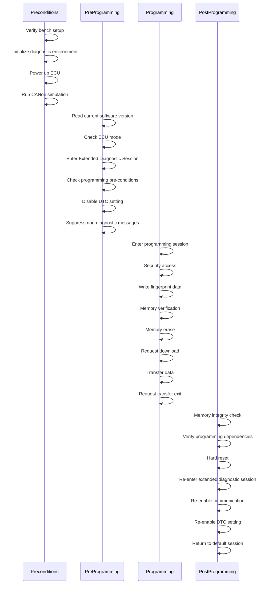
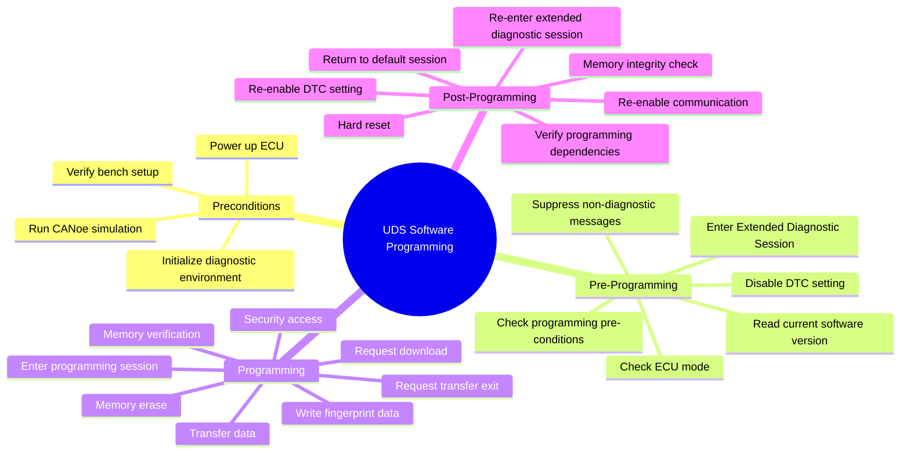

---
# UDS Software Programming Procedure (ISO 14229)
---

## Visual Overview

### Sequence Diagram

### Mindmap

---

## Step-by-Step Procedure

### 1. Preconditions
Prepare the test bench and environment:
- Verify bench setup connections (CAN bus, power, ground)
- Initialize diagnostic environment (CANoe, CAN channels, diagnostic DBs)
- Power up ECU and confirm operational state
- Start CANoe simulation for network communication

### 2. Pre-Programming
Prepare ECU for programming:
- Read current software version (ReadDataByIdentifier 0x22)
- Check ECU mode (application/bootloader)
- Enter Extended Diagnostic Session (DiagnosticSessionControl 0x10 0x03)
- Check programming pre-conditions (RoutineControl 0x31 0x01 [RID])
- Disable DTC setting (ControlDTCSetting 0x85 0x02)
- Suppress non-diagnostic messages (CommunicationControl 0x28 0x03 0x01)

### 3. Programming
Perform the software flashing:
- Enter programming session (DiagnosticSessionControl 0x10 0x02)
- Security access (SecurityAccess 0x27 0x01/0x02)
- Write fingerprint data (WriteDataByIdentifier 0x2E [DID] [data])
- Memory verification (RoutineControl 0x31 0x01 [verify_routine_RID])
- Memory erase (RoutineControl 0x31 0x01 [erase_routine_RID])
- Request download (RequestDownload 0x34)
- Transfer data (TransferData 0x36)
- Request transfer exit (RequestTransferExit 0x37)

### 4. Post-Programming
Validate and restore ECU:
- Memory integrity check (RoutineControl 0x31 0x01 0x02 0x02)
- Verify programming dependencies (RoutineControl 0x31 0x01 [dependency_check_RID])
- Hard reset (ECUReset 0x11 0x01)
- Re-enter extended diagnostic session (DiagnosticSessionControl 0x10 0x03)
- Re-enable communication (CommunicationControl 0x28 0x01 0x01)
- Re-enable DTC setting (ControlDTCSetting 0x85 0x01)
- Return to default session (DiagnosticSessionControl 0x10 0x01)
- Resume CANoe simulation of normal network messages

---

# UDS Software Programming Procedure

## 1. Pre-Programming Setup
1. **Verify bench setup connections:** Ensure all physical connections (CAN bus, power, ground) are correct and secure.
2. **Initialize diagnostic environment:** Open CANoe, configure CAN channels, and load diagnostic databases.
3. **Power up ECU:** Apply power and verify ECU reaches operational state.
4. **Run CANoe simulation:** Start network simulation to enable communication.

## 2. Software Version Verification
5. **Read current software version:** Use ReadDataByIdentifier (0x22) to document baseline state before Programming.

## 3. Pre-Programming Sequence (Application Mode Only)
6. **Check ECU mode:** Verify ECU is in application mode. If already in bootloader mode, skip to step 10.
7. **Enter Extended Diagnostic Session:**
   - Send DiagnosticSessionControl (0x10 0x03) to enable extended diagnostic functions.
8. **Check programming pre-conditions:**
   - Send RoutineControl (0x31 0x01 [RID]) to verify ECU is ready for programming.
9. **Disable DTC setting:**
   - Send ControlDTCSetting (0x85 0x02) to prevent diagnostic trouble codes during Programming.
10. **Suppress non-diagnostic messages:**
    - Stop CANoe simulation from sending non-diagnostic network messages.
    - Send CommunicationControl (0x28 0x03 0x01) to disable normal ECU communication.

## 4. Programming Session Initialization
11. **Enter programming session:**
    - Send DiagnosticSessionControl (0x10 0x02) to enable programming capabilities.
12. **Security access:**
    - Request seed: Send SecurityAccess (0x27 0x01) to get random seed from ECU.
    - Calculate and send key: Send SecurityAccess (0x27 0x02 [calculated_key]) for authentication.

## 5. Fingerprint and Pre-Flash Verification
13. **Write fingerprint data:**
    - Send WriteDataByIdentifier (0x2E [DID] [fingerprint_data]) to record programming session metadata (date, shop code, programmer ID, software version).
14. **Memory verification:**
    - Send RoutineControl (0x31 0x01 [verify_routine_RID]) for partial Programming validation.

## 6. Flash Memory Programming
15. **Memory erase:**
    - Send RoutineControl (0x31 0x01 [erase_routine_RID]) to clear target memory sections.
16. **Request download:**
    - Send RequestDownload (0x34 [data_format] [address_length_format] [memory_address] [memory_size]).
17. **Transfer data:**
    - Send multiple TransferData (0x36 [block_counter] [data_block]) requests. Block sequence counter starts at 0x01 and increments for each transfer until all firmware data is downloaded.
18. **Request transfer exit:**
    - Send RequestTransferExit (0x37) to complete the data transfer phase.

## 7. Post-Transfer Validation
19. **Memory integrity check:**
    - Send RoutineControl (0x31 0x01 0x02 0x02) to verify downloaded data integrity.
20. **Verify programming dependencies:**
    - Send RoutineControl (0x31 0x01 [dependency_check_RID]) to validate software dependencies.

## 8. ECU Reset and Application Transition
21. **Hard reset:**
    - Send ECUReset (0x11 0x01) to perform hard reset and restart ECU.

## 9. Post-Programming Validation
22. **Re-enter extended diagnostic session:**
    - Send DiagnosticSessionControl (0x10 0x03) after ECU restart.
23. **Re-enable communication:**
    - Send CommunicationControl (0x28 0x01 0x01) to restore normal ECU communication.
24. **Re-enable DTC setting:**
    - Send ControlDTCSetting (0x85 0x01) to restore diagnostic trouble code functionality.
25. **Return to default session:**
    - Send DiagnosticSessionControl (0x10 0x01) to return ECU to normal operational mode.
    - Resume CANoe simulation of normal network messages.
