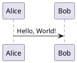
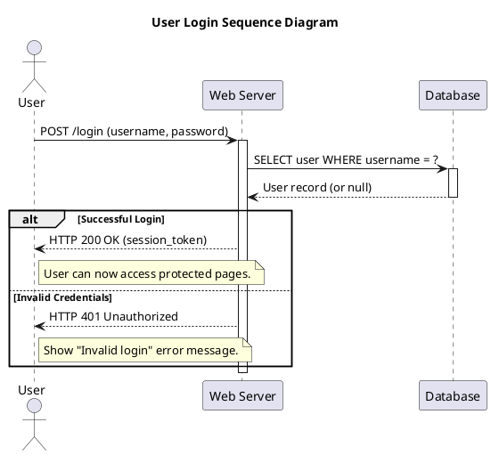

# 🌱 PlantUML: The "Draw with Text" Wizard

PlantUML is like that friend who can sketch your entire system architecture on a napkin while you're still looking for a pen. It turns simple text into professional diagrams. No mouse dragging required. 🎨

---

## 🚀 Prerequisites

| Requirement | Details |
|-------------|---------|
| **☕ Java**  | Java 8+ is required. Check with `java -version`. If missing, grab it from [Adoptium](https://adoptium.net/). |
| **🔧 Graphviz** | (Optional but recommended) Required for some complex diagrams. |

---

## ⚡ Quick Start (Copy-Paste-Run)

1. **Download** `plantuml.jar` from [plantuml.com](https://plantuml.com/download).
2. **Write** a text file (e.g., `diagram.puml`).
3. **Run**: `java -jar plantuml.jar diagram.puml`
4. **Profit**: You get a `.png` image.

---

## 🧩 Core Concepts

Everything lives inside `@startuml` and `@enduml`. It's the bread and butter of PlantUML.



---

## 🚀 Your First Diagram: The Login Flow

Let's model a real-world login scenario. We'll use a **Sequence Diagram** because it's the best way to show "who said what to whom and when".

### The Code (`examples/sequence_login.puml`)

[View File](examples/sequence_login.puml)



### 💡 Pro Tips
- `participant`: Defines the columns.
- `->`: Message sent.
- `-->`: Reply sent.
- `alt/else`: If/Else logic for diagrams.

---

## 🖼️ Diagram Gallery: A Tour of Possibilities

We've prepared a buffet of examples for you in the `examples/` folder.

### 🕒 Sequence Diagram
**File:** [`examples/sequence_login.puml`](examples/sequence_login.puml)
- Best for: API flows, authentication, protocol handshakes.

### 🎭 Use Case Diagram
**File:** [`examples/usecase_login.puml`](examples/usecase_login.puml)
- Best for: High-level feature requirements.

### 🏷️ Class Diagram
**File:** [`examples/class_car.puml`](examples/class_car.puml)
- Best for: OOP structure, database schemas.

### 🏃 Activity Diagram
**File:** [`examples/activity_login.puml`](examples/activity_login.puml)
- Best for: Flowcharts, business logic, decision trees.

### 🧩 Component Diagram
**File:** [`examples/component_arch.puml`](examples/component_arch.puml)
- Best for: System architecture, microservices.

### 🔄 State Diagram
**File:** [`examples/state_machine.puml`](examples/state_machine.puml)
- Best for: Lifecycle of an object (e.g., Order Status: New -> Paid -> Shipped).

### 📦 JSON Data
**File:** [`examples/json_data.puml`](examples/json_data.puml)
- Best for: Visualizing complex JSON structures.

### 🧠 Mindmap
**File:** [`examples/mindmap_project.puml`](examples/mindmap_project.puml)
- Best for: Brainstorming, organizing thoughts.

### 🪜 WBS (Work Breakdown Structure)
**File:** [`examples/wbs_project.puml`](examples/wbs_project.puml)
- Best for: Project planning, task breakdown.

### 📅 Gantt Chart
**File:** [`examples/gantt_project.puml`](examples/gantt_project.puml)
- Best for: Timelines, schedules.

---

## 🔌 Integrations (Where to write this stuff)

| Tool | How |
|------|-----|
| **VS Code** | Install the "PlantUML" extension by Jebbs. It's awesome. |
| **IntelliJ** | Built-in or plugin. |
| **Markdown** | Many tools (like GitHub/GitLab) render these blocks automatically. |

---

## 🛠️ Troubleshooting

- **"Java not found"**: Install Java. Seriously, it needs Java.
- **"Graphviz not found"**: Some diagrams (like Class diagrams) need Graphviz installed on your OS.
- **"Syntax Error"**: You probably missed an `@enduml` or misspelled a keyword.

---

## 🔗 References

- [Official Docs](https://plantuml.com/) - The bible.
- [Real World PlantUML](https://real-world-plantuml.com/) - Inspiration.
```
