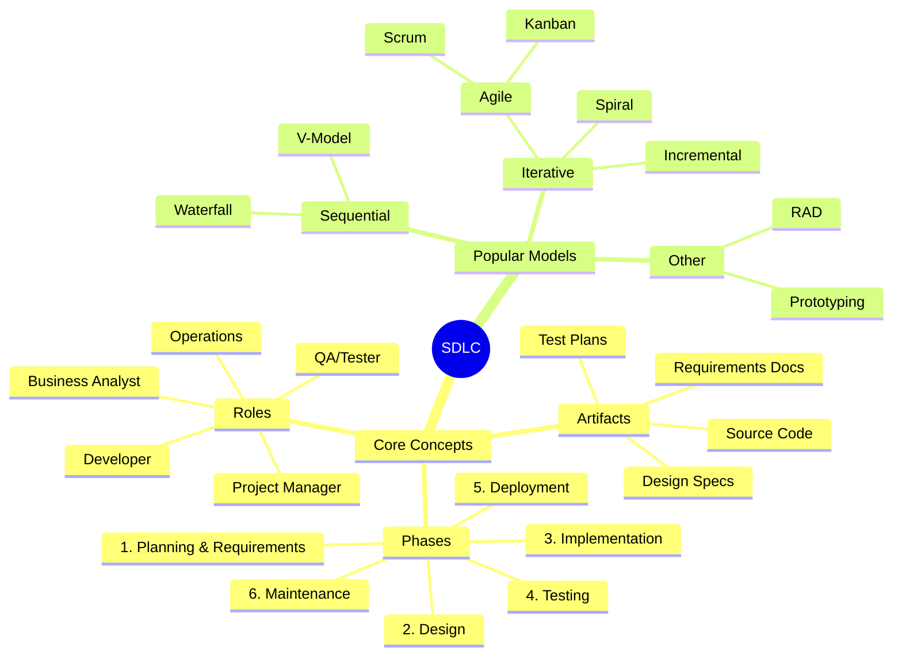

# 🚀 The Software Development Life Cycle (SDLC): Your Project's GPS

Ever tried to build IKEA furniture without the instructions? You might end up with a wobbly chair and a pile of "extra" screws. 😅 Building software is a lot like that, but on a much bigger scale. The **Software Development Life Cycle (SDLC)** is the instruction manual that guides teams from a brilliant idea to a finished, high-quality product without the wobbles.

This guide will explore the what, why, and how of the SDLC, helping you choose the best "path" for your project's journey.

---

## 🤔 What is the SDLC and Why Does It Matter?

**What is it?**
The SDLC is a structured process that software teams use to **design, develop, test, and deploy** software. Think of it as a roadmap that ensures everyone is heading in the same direction, speaking the same language, and working towards the same goal.

**Why does it matter?**
Without a good roadmap, projects can get lost. The SDLC helps to:
*   ✅ **Ensure Quality:** By building in testing and reviews at every stage.
*   💰 **Control Costs:** By planning resources and reducing expensive rework.
*   🤝 **Improve Collaboration:** By giving everyone clear roles and responsibilities.
*   🎯 **Hit the Target:** By making sure the final product actually meets the business needs and solves the right problems.

---

## 🧠 The SDLC Ecosystem: A Bird's-Eye View

The SDLC isn't just one linear path. It's an entire ecosystem of phases, models, people, and tools. This mindmap gives you a high-level overview of how everything fits together.

---

## 🏗️ The Building Blocks: Core Phases of SDLC

No matter which SDLC model you choose, you'll likely go through these core phases in some form or another.

1.  **Planning & Requirements:** The "What are we doing?" phase. Here, you define the project's goals, scope, and what it needs to do.
2.  **Design:** The "How will we do it?" phase. Architects and developers create the blueprint for the system, including its architecture, UI/UX, and database structure.
3.  **Implementation (Coding):** The "Let's build it!" phase. Developers write the actual code based on the design blueprints.
4.  **Testing:** The "Does it work correctly?" phase. The QA team rigorously tests the software for bugs, performance issues, and to ensure it meets the requirements.
5.  **Deployment:** The "Let's go live!" phase. The finished software is released to users.
6.  **Maintenance:** The "Keep it running smoothly" phase. This involves fixing bugs, adding minor enhancements, and providing support.

---

## 🗺️ A Tour of Popular SDLC Models

The core phases are the "what," but the SDLC models are the "how." Each model is a different strategy for navigating the phases. Let's explore the most popular ones.

### The Waterfall Model 🌊

This is the classic, the original, the granddaddy of them all. The Waterfall model is a **linear, sequential** approach. You must finish one phase completely before moving on to the next, just like you can't build the roof of a house before the walls are up.

*   **Real-World Analogy: Building a House 🏠**
    1.  **Requirements:** You meet with the architect and decide you need 3 bedrooms, 2 bathrooms, and a big kitchen. These plans are finalized and signed off.
    2.  **Design:** The architect draws up detailed blueprints.
    3.  **Implementation:** The construction crew builds the house *exactly* as specified in the blueprints.
    4.  **Testing (Inspection):** The building inspector checks the house to ensure it's built to code.
    5.  **Deployment (Move-in):** You get the keys and move in!
    6.  **Maintenance:** You fix a leaky faucet or repaint a room years later.

*   **Best for:** Projects with stable, well-understood requirements that are unlikely to change.
*   **Pros:** Simple to manage, clear stages and deliverables.
*   **Cons:** Very inflexible. If you decide you want a fourth bedroom after the foundation is poured, it's a huge and costly problem.

### The V-Shaped Model ✔️

The V-Model is a variation of Waterfall that puts a huge emphasis on **testing**. For every development phase, there is a corresponding testing phase. It's all about catching defects as early as possible.

*   **Real-World Analogy: Developing a Pacemaker 🩺**
    *   When you define the **requirements** for how the pacemaker should function, you also write the **user acceptance tests** to prove it works for the patient.
    *   When you create the **high-level system design**, you also create the **system integration tests**.
    *   When you write the **detailed component design**, you also write the **unit tests** for each component.
    This ensures that testing is planned from the very beginning and is tied directly to the design.

*   **Best for:** Systems where failure is not an option (medical devices, aviation, automotive).
*   **Pros:** High-quality, reliable products due to the rigorous testing.
*   **Cons:** Still inflexible like Waterfall; not good for projects with uncertain requirements.

### The Agile Model 🏃‍♂️💨

Agile isn't a single model, but a **mindset and a collection of practices** that prioritize flexibility, collaboration, and rapid delivery. It's about working in small, iterative cycles called "sprints."

*   **Real-World Analogy: Developing a New Food Delivery App 📱**
    1.  **Sprint 1 (2 weeks):** Instead of building the whole app, the team focuses on one core feature: "A user can view a list of restaurants." They build, test, and release just that.
    2.  **Feedback:** Early users say, "This is great, but I really want to be able to search for a specific type of food."
    3.  **Sprint 2 (2 weeks):** The team builds the search feature.
    4.  **Sprint 3 (2 weeks):** The team adds the ability to place an order.
    The app evolves in small, functional pieces based on continuous feedback.

*   **Popular Methods:** **Scrum** (focused on sprints and roles like Scrum Master) and **Kanban** (focused on visualizing workflow on a board).
*   **Best for:** Projects where requirements are expected to change or are not fully known at the start. Perfect for startups and fast-moving environments.
*   **Pros:** Highly flexible, great for customer satisfaction, delivers value quickly.
*   **Cons:** Can be hard to predict a final delivery date or budget.

### The Spiral Model 🌀

The Spiral model is all about **risk management**. It's like a series of mini-Waterfalls, where each loop (or "spiral") is a full cycle of planning, risk analysis, building a prototype, and evaluation.

*   **Real-World Analogy: Building a Reusable Mars Rocket 🚀**
    *   The project is incredibly complex and risky. You don't know what you don't know.
    *   **Spiral 1:** Focus on the biggest risk: the engine. **Analyze** the risks, **build** a prototype engine, and **test** it.
    *   **Spiral 2:** The engine works! Now, tackle the next biggest risk: the heat shield. **Analyze**, **build** a prototype, and **test** it.
    *   **Spiral 3:** Now, the landing system...
    With each spiral, the project gets bigger and the risks are systematically eliminated.

*   **Best for:** Large, complex, and high-risk projects. Great for research and development.
*   **Pros:** Excellent for managing uncertainty and risk.
*   **Cons:** Can be complex and expensive to manage.

### The Prototyping Model 🎨

The Prototyping model is about building a **working model or mockup** of the system to get user feedback before you build the real thing.

*   **Real-World Analogy: Designing a New Car's Infotainment System 🚗**
    *   Instead of just writing a description of the system, the designers build an interactive prototype on a tablet.
    *   They give it to potential customers and say, "Try to find the radio, adjust the AC, and enter a destination."
    *   Based on watching where users struggle, they refine the prototype's layout and menus *before* a single line of code for the final system is written.

*   **Best for:** Projects where the user interface (UI) and user experience (UX) are critical.
*   **Pros:** Reduces the risk of building the wrong thing; great for clarifying fuzzy requirements.
*   **Cons:** Users might mistake the prototype for the final product; can add time to the project.

### The Incremental & RAD Models 🧱

**Incremental:** You build the product piece by piece in functional "increments." The first increment might be a very basic, stripped-down version, and each subsequent increment adds more features.

**RAD (Rapid Application Development):** A type of incremental model that's hyper-focused on speed, often using component-based construction and workshops to get things done in a very short time (e.g., 60-90 days).

*   **Real-World Analogy: Building a Large E-commerce Website**
    *   **Increment 1:** Build the core functionality: users can view products and add them to a cart. Release it.
    *   **Increment 2:** Add the checkout and payment system. Release it.
    *   **Increment 3:** Add user reviews and ratings. Release it.
    The website becomes more powerful with each increment.

*   **Best for:** Large projects that can be broken down into smaller, self-contained modules.
*   **Pros:** Delivers value to customers early; more flexible than Waterfall.
*   **Cons:** Requires a very clear architectural vision to ensure all the pieces fit together.

---

## 🤔 How to Choose the Right Model?

There's no single "best" model. The right choice depends entirely on your project! Ask yourself these questions:

*   **How clear are my requirements?** If they are crystal clear and unlikely to change, **Waterfall** might work. If they are fuzzy or expected to evolve, **Agile** or **Prototyping** is your friend.
*   **How high is the risk?** For complex, high-risk projects where you need to manage uncertainty, the **Spiral** model is designed for risk management.
*   **How fast do I need to deliver?** If speed is critical and you can break the project into smaller pieces, **Agile** or **RAD** are built for rapid delivery.
*   **What are the quality constraints?** For systems where failure is not an option (like medical or aviation software), the **V-Model**'s intense focus on testing is a great fit.

---

## 🙈 Common Pitfalls (And How to Avoid Them!)

Navigating the SDLC isn't always smooth sailing. Here are some common traps:

*   **The "Vague Requirements" Trap:** Starting to build without a clear idea of what you're building.
    *   **How to avoid:** Invest time in the requirements phase. Talk to users, build prototypes, and get sign-offs.
*   **The "Scope Creep" Monster:** When new features and requests keep getting added, bloating the project.
    *   **How to avoid:** Have a formal change control process. For every new request, assess its impact on time, cost, and resources.
*   **The "Communication Black Hole" Problem:** When stakeholders and team members don't talk to each other.
    *   **How to avoid:** Daily stand-ups (Agile), regular status meetings, and clear documentation.

---

## 📝 Key Takeaways

*   The SDLC provides structure and predictability to software development.
*   There is no "one-size-fits-all" model; the best choice depends on your project's unique needs.
*   The goal is always to deliver high-quality software that meets user needs efficiently.
*   Hybrid models (like "Wagile" - a mix of Waterfall and Agile) are becoming very common.

---

## 🔗 References & Further Reading

- [IEEE 12207: Software Life Cycle Processes](https://ieeexplore.ieee.org/document/720574)
- [ISO/IEC 12207: Software Life Cycle Processes](https://www.iso.org/standard/43447.html)
- [Agile Manifesto](https://agilemanifesto.org/)