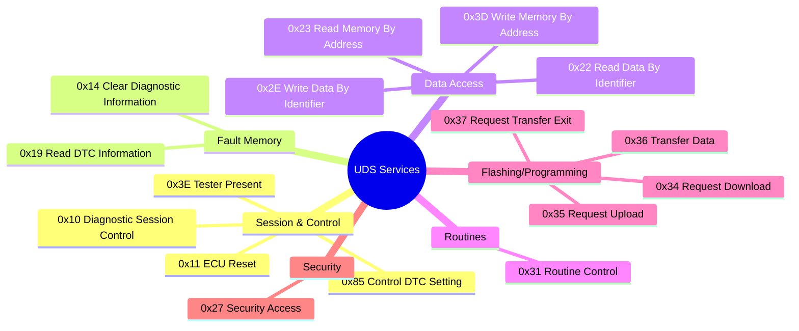

# 🚗 UDS: The Secret Language of Car Diagnostics

UDS (Unified Diagnostic Services, ISO 14229) is how diagnostic tools and ECUs have actual conversations. If CAN is the highway and DoIP is the postal service, then UDS is the **language** everyone speaks. It's a standardized set of "questions and answers" that work across all modern vehicles, regardless of manufacturer.

This guide will make you fluent in UDS—from reading fault codes to flashing software.

---

## 🎯 What Makes It "Unified"?

**Before UDS:** Every car brand had its own proprietary diagnostic protocol. Want to diagnose a Mercedes? You need Mercedes tools. BMW? Different tools. It was chaos.

**After UDS:** One protocol to rule them all. A single diagnostic tool can now talk to any UDS-compliant ECU, whether it's in a Ford, VW, or Tesla.

---

## 🗺️ UDS Services Map

UDS is organized into services (like API endpoints). Here's the landscape:



---

## 🧠 Core Concepts (The Basics You Need)

### Request-Response Pattern

Every UDS interaction follows a simple pattern:

```
Tester (You) ───[Request]───> ECU
Tester (You) <──[Response]─── ECU
```

### Service ID (SID)

Think of this as the "command code." Every service has a unique byte:
- `0x22` = "Read data"
- `0x2E` = "Write data"  
- `0x19` = "Read fault codes"

### Positive vs. Negative Responses

**Positive Response:** ECU adds `0x40` to the SID.
- Request: `22` (Read)
- Response: `62` (22 + 40 = 62) = Success!

**Negative Response:** Always starts with `7F`.
- Response: `7F 22 31` = "Service 0x22 failed, reason: Request Out Of Range"

### Negative Response Code (NRC)

When something fails, the NRC tells you why:
- `0x13` = Wrong message length
- `0x22` = Conditions not right (e.g., car is moving)
- `0x33` = Security access denied
- `0x35` = Invalid key (wrong password)

---

## 📖 Service Documentation

We've created detailed guides for each major UDS service. Click to learn more:

### Session & Control
- **[0x10 Diagnostic Session Control](services/0x10_diagnostic_session_control.md)** - Unlock different diagnostic modes
- **[0x11 ECU Reset](services/0x11_ecu_reset.md)** - Reboot the ECU
- **[0x3E Tester Present](services/0x3e_tester_present.md)** - Keep session alive (heartbeat)
- **[0x85 Control DTC Setting](services/0x85_control_dtc_setting.md)** - Enable/disable fault recording

### Fault Memory (DTCs)
- **[0x19 Read DTC Information](services/0x19_read_dtc_information.md)** - Read fault codes and freeze frames
- **[0x14 Clear Diagnostic Information](services/0x14_clear_diagnostic_information.md)** - Clear fault codes

### Data Access
- **[0x22 Read Data By Identifier](services/0x22_read_data_by_identifier.md)** - Read structured data (VIN, sensor values, etc.)
- **[0x2E Write Data By Identifier](services/0x2e_write_data_by_identifier.md)** - Write configuration/calibration
- **[0x23 Read Memory By Address](services/0x23_read_memory_by_address.md)** - Direct memory reading
- **[0x3D Write Memory By Address](services/0x3d_write_memory_by_address.md)** - Direct memory writing (dangerous!)

### Routines & Testing
- **[0x31 Routine Control](services/0x31_routine_control.md)** - Run ECU self-tests and procedures

### Programming/Flashing
- **[0x34 Request Download](services/0x34_request_download.md)** - Initiate software download to ECU
- **[0x35 Request Upload](services/0x35_request_upload.md)** - Initiate software upload from ECU  
- **[0x36 Transfer Data](services/0x36_transfer_data.md)** - Transfer data chunks
- **[0x37 Request Transfer Exit](services/0x37_request_transfer_exit.md)** - Finalize transfer

### Security
- **[0x27 Security Access](services/0x27_security_access.md)** - Unlock protected operations (seed-key challenge)

---

## 🚀 Real-World Scenario: Reading and Clearing Fault Codes

Let's walk through a typical diagnostic session:

```
Step 1: Enter Extended Session
→ Request:  10 03
← Response: 50 03
   (Unlocks more diagnostic features)

Step 2: Request Security Access (if needed)
→ Request:  27 01
← Response: 67 01 12 34
   (Seed: 0x1234)

→ Calculate key offline
   Key = CalculateKey(0x1234) = 0xABCD

→ Request:  27 02 AB CD
← Response: 67 02
   (Unlocked!)

Step 3: Read Fault Codes
→ Request:  19 02 09
← Response: 59 02 FF P0 13 5A 09 P0 14 2B 08
   (2 DTCs found)

Decoded:
- P0135A: O2 Sensor Heater Circuit (confirmed, active)
- P0142B: MAP Sensor Out of Range (confirmed)

Step 4: Clear Fault Codes (after fixing issues)
→ Request:  14 FF FF FF
← Response: 54
   (All DTCs cleared!)

Step 5: Verify Clear
→ Request:  19 02 09
← Response: 59 02 FF
   (No DTCs—clean!)
```

---

## 🏅 Best Practices

- **Check for negative responses:** Don't assume success. A `7F` response means "something went wrong"—read the NRC!
- **Security is key:** Many operations (writing calibration, clearing DTCs, flashing) require security unlock via 0x27.
- **Know your sessions:** Default session is limited. Extended session unlocks advanced diagnostics. Programming session is for flashing.
- **Keep sessions alive:** Send 0x3E TesterPresent every 2-3 seconds to prevent timeout.

---

## 📚 Further Reading

- [ISO 14229-1:2020](https://www.iso.org/standard/72439.html) (Official UDS standard)
- [UDS on Wikipedia](https://en.wikipedia.org/wiki/Unified_Diagnostic_Services)
